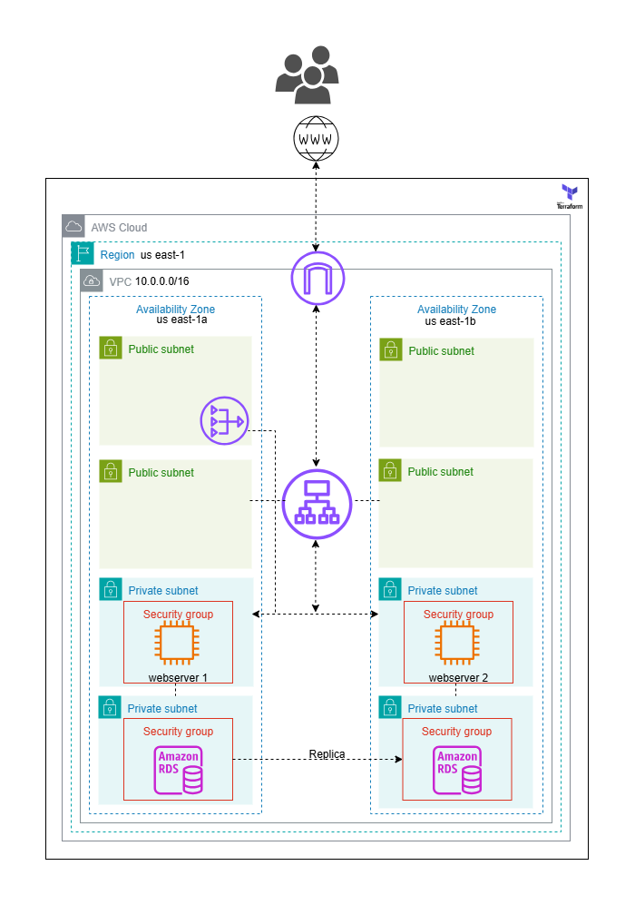
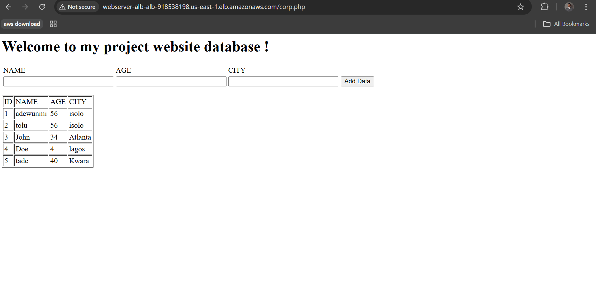
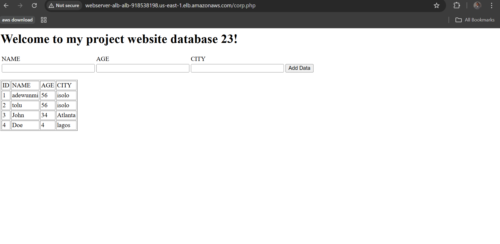

# Terraform AWS High Availability Web Infrastructure

This repository contains modular, Terraform code to provision a **highly available**, **secure**, and **scalable** web infrastructure on AWS using best practices.

---
Overview
---

The infrastructure includes:

- A custom **VPC** with public and private subnets across **two Availability Zones**
- A **NAT Gateway** in a public subnet with a route to the internet for the EC2 instances.
- An **Application Load Balancer (ALB)** to distribute traffic across EC2 instances
- EC2 web servers in **private subnets**, provisioned with custom user data
- A **Multi-AZ Amazon RDS** deployment with automatic replication
- Properly scoped **Security Groups** for fine-grained network access control
- Infrastructure as Code using **Terraform modules**

---

## Architecture Diagram



> **Diagram Description**:
> - **Users** connect through the **internet** to the **Application Load Balancer (ALB)** located in **public subnets**
> - The **ALB** routes traffic to **EC2 web servers** in **private subnets** across two AZs
> - Web servers interact with **Amazon RDS**, deployed with a **read replica** in a separate AZ
> - All components are placed in a custom **VPC** (`10.0.0.0/16`) with isolated **subnets**, **route tables**, and **security groups**

---

## Project Structure

```bash
.
├── assest/
│   └── vpc_ec2_rds.drawio (4).png      # AWS Architecture Diagram
├── scripts/
│   ├── bootstrap_1.sh                  # User data script for webserver 1
│   └── bootstrap_2.sh                  # User data script for webserver 2
├── terraform/
│   ├── main.tf                         # Main Terraform configuration
│   ├── provider.tf                     # AWS provider configuration
│   ├── backend.tf                      # Remote state backend (S3 + DynamoDB)
│   ├── variables.tf                    # Input variable declarations
│   ├── terraform.auto.tfvars           # Values for input variables
│   ├── output.tf                       # Outputs (e.g., subnet IDs, ALB DNS)
│   ├── local.tf                        # Local variables and naming conventions
└── README.md                           # Project documentation
```
----
### Components and Resources
----

| Component           | Description                                                     |
| ------------------- | --------------------------------------------------------------- |
| **VPC**             | Custom VPC with CIDR `10.0.0.0/16`                              |
| **Subnets**         | 2 public + 2 private subnets across 2 AZs                       |
| **ALB**             | Application Load Balancer in public subnet, routing HTTP/S      |
| **EC2 Instances**   | Web servers with attached security groups and user-data scripts |
| **RDS**             | Multi-AZ PostgreSQL or MySQL deployment with read replica       |
| **Security Groups** | Separate groups for ALB, EC2, and RDS with restricted rules     |
| **Backend State**    | S3 bucket with state locking                     |

----
Security Notes
---
- No direct internet access to EC2 or RDS — only ALB is publicly accessible

- Least-privilege security groups:

    - ALB ➝ EC2 on port 80

    - EC2 ➝ RDS on port 3306

- Credentials (DB password, etc.) are stored in AWS SSM Parameter Store

---
Requirements
--
- Terraform v1.3 or newer

- AWS CLI configured

- AWS IAM user with access to EC2, VPC, RDS, S3, and IAM services

- Pre-created S3 bucket for remote state

---
Usage
---

**1. Clone the repository**
```bash
git clone https://github.com/protechanalysis/ALB-RDS-EC2.git

cd terraform
```
*Note don't forget configure *terraform.tfvars**

**2. Initialize Terraform**
```bash
terraform init
```
**3. Format Configuration Files**
```bash
terraform fmt
```
**4. Validate the Configuration**
```bash
terraform validate
```
**5. Review the Plan**
```bash
terraform plan -out=tf.plan
```
**6. Apply the Configuration**
```bash
terraform apply tf.plan
```
---
Testing the Infrastructure
---
Once deployed:
- Visit the ALB DNS Name from the Terraform output for the *webserver url*

---
Webserver Deployed
---





*Don't forget to terminate your resources when you're done... unless you want NAT Gateway to become your most expensive pen pal.😄*